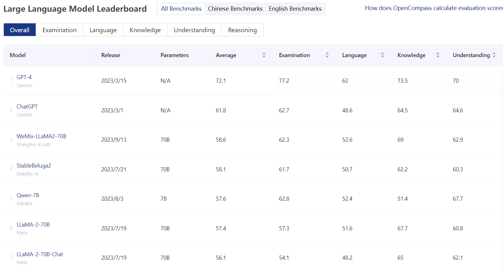

## WeMix-LLM

WeMix-LLM includes a series of LLMs and multimodal LLMs following the same paradigm. WeMix-LLM is built on [LLaMA2-Accessory](https://github.com/Alpha-VLLM/LLaMA2-Accessory).



### Changelog
* **[2023-10-16]** WeMix-LLM-V2 is now avaliable at [WeMix-LLaMA2-V2-70B](https://huggingface.co/Alpha-VLLM/WeMix-LLaMA2-V2-70B).
* **[2023-8-31]** Release WeMix-LLM!

### Setup

Please follow the [Environment Setup](https://llama2-accessory.readthedocs.io/en/latest/install.html) of LLaMA2-Accessory.

### Models

#### WeMix-LLaMA2: An Instruction-Following LLM
* Weight: [WeMix-LLaMA2-7B](https://huggingface.co/Alpha-VLLM/WeMix-LLaMA2-7B), [WeMix-LLaMA2-70B](https://huggingface.co/Alpha-VLLM/WeMix-LLaMA2-70B), [WeMix-LLaMA2-V2-70B](https://huggingface.co/Alpha-VLLM/WeMix-LLaMA2-V2-70B).
* Demo:
    ```bash
    wemix_weight=path/to/WeMix-LLaMA2-[7B/70B]/

    python demos/multi_turn.py \
    --llama_config ${wemix_weight}/params.json --tokenizer_path ${wemix_weight}/tokenizer.model \
    --pretrained_path ${wemix_weight} --n_gpus [1/4]
    ```
* Benchmark (OpenCompass):

| Model         | WeMix-LLaMA2-70B | LLaMA2-70B | Vicuna-33B | WeMix-LLaMA2-7B | LLaMA-2-7B-Chat | Vicuna-7B | LLaMA-2-7B |
|---------------|------------------|------------|------------|-----------------|-----------------|-----------|------------|
| OVERALL       | 58.6             | 57.4       | 50         | 49.6            | 44.8            | 43.4      | 41.6       |
| EXAM          | 62.3             | 57.3       | 49.2       | 45.5            | 40.1            | 40.5      | 35.5       |
| LANGUAGE      | 52.6             | 51.6       | 44.9       | 45.1            | 44              | 39.6      | 44.1       |
| KNOWLEDGE     | 69               | 67.7       | 61.3       | 59.4            | 54.3            | 51.7      | 53.3       |
| UNDERSTANDING | 62.9             | 60.8       | 58.5       | 55.5            | 50.9            | 50.5      | 42.4       |
| REASONING     | 54.1             | 55         | 44.7       | 47.4            | 41.4            | 39.9      | 40.1       |

> Please refer to [benchmark.md](./benchmark.md) for more details.

#### WeMix-LLaMA2-13B-MM: A Multimodal LLM

* Weight: [Alpha-VLLM/WeMix-LLaMA2-13B-MM](https://huggingface.co/Alpha-VLLM/WeMix-LLaMA2-13B-MM)
* Demo:
```bash
wemix_weight=path/to/WeMix-LLaMA2-13B-MM

torchrun --nproc-per-node=2 demos/single_turn_mm.py \
--llama_config ${wemix_weight}/params.json --tokenizer_path ${wemix_weight}/tokenizer.model \
--pretrained_path ${wemix_weight}
```
* Multimodal Benchmark:

| Model                     | NoCaps               | Flickr30K |
|---------------------------|----------------------|-----------|
| Flamingo-9B               | -                    | 61.5      |
| Flamingo-80B              | -                    | 67.2      |
| Unified-IO-XL             | 100.0                | -         |
| Kosmos-1                  | -                    | 67.1      |
| Kosmos-2                  | -                    | 66.7      |
| BLIP-2 (Vicuna-13B)       | 103.9                | 71.6      |
| InstructBLIP (Vicuna-13B) | 121.9                | 82.8      |
| Shikra (Vicuna-13B)       | -                    | 73.9      |
| Qwen-VL (Qwen-7B)         | 121.4                | 85.8      |
| Qwen-VL-Chat              | 120.2                | 81.0      |
| WeMix-LLaMA2-13B-MM        | 114.7                | 86.0      |

> The multimodal benchmark is still in progress. Stay tuned!🎉

<!-- ### Contributors -->

### Acknowledgement

[LLaMA2-Accessory](https://github.com/Alpha-VLLM/LLaMA2-Accessory), [LLaMA-Adapter](https://github.com/OpenGVLab/LLaMA-Adapter), [LLaMA](https://github.com/facebookresearch/llama).

### License

Llama 2 is licensed under the [LLAMA 2 Community License](https://github.com/facebookresearch/llama/blob/main/LICENSE), Copyright (c) Meta Platforms, Inc. All Rights Reserved.
